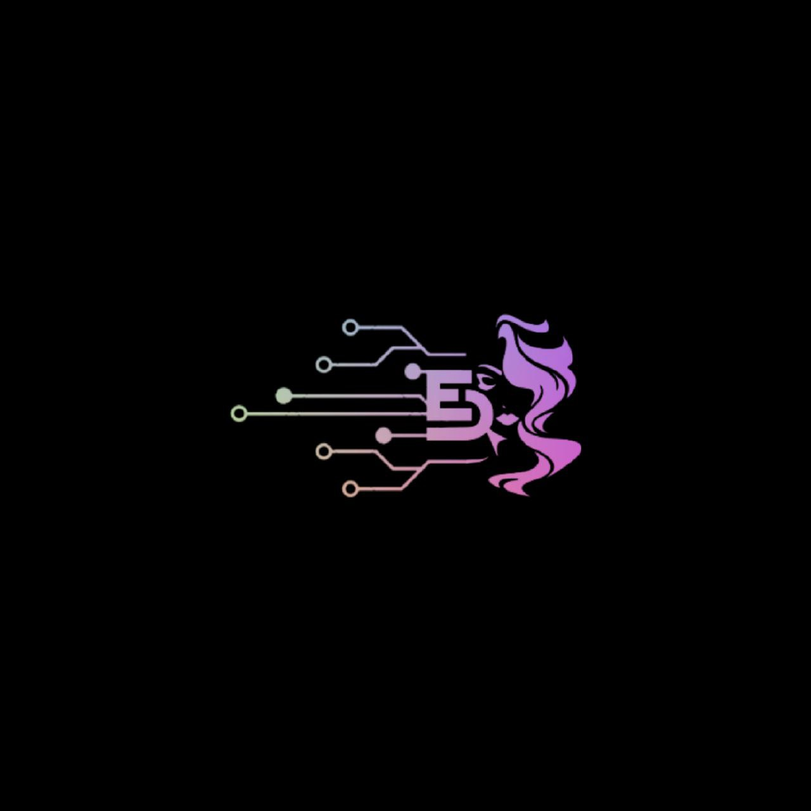
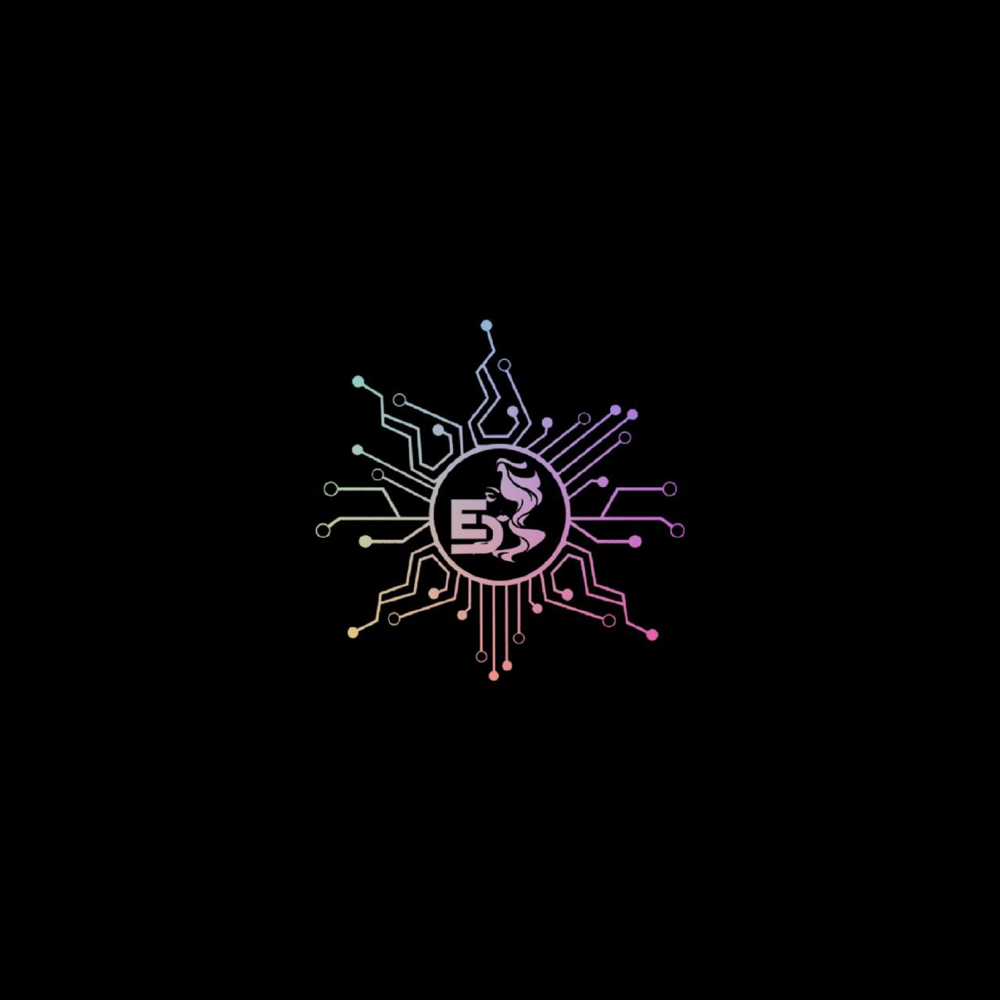

- 👋 Hi, I’m @ElaNyx03
- 👀 I’m interested in ...
- 🌱 I’m currently learning ...
- 💞️ I’m looking to collaborate on ...
- 📫 How to reach me ...

<!---
ElaNyx03/ElaNyx03 is a ✨ special ✨ repository because its `README.md` (this file) appears on your GitHub profile.
You can click the Preview link to take a look at your changes.
--->

###  Benvenuti nel mio spazio di progresso e scoperta.

---

---

 🔧 𝕋𝕖𝕔𝕙𝕟𝕠𝕝𝕠𝕘𝕚𝕖𝕤 & 𝕋𝕠𝕠𝕝𝕤

 
###  
 
